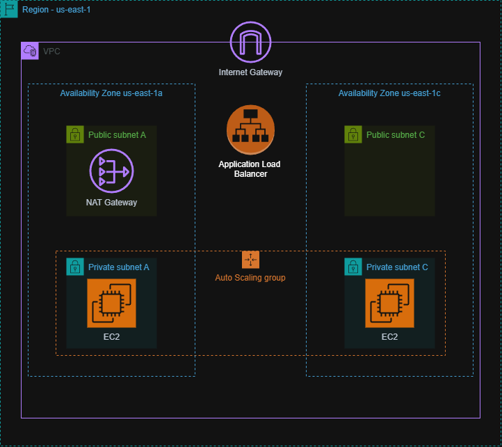

# AWS Immersion Day Labs

### Compute
##### Basic EC2 Web Server
- Use [`userdata.txt`](userdata.txt) to create a basic EC2 web server

##### Auto Scaling with CloudFormation
- Edit template to allow t3.micro for use with the free tier and set it as the default
- Create AMI from EC2 instance
- Setup auto scaling group using AMI for launch template, attach new SG for ASG
- Create new ALB with target group, attach new SG for ALB
- Configure inbound rules for SGs
- Test with DNS and CPU load generator ✅

## Network

### VPC and Security Groups
- Created VPC with two subnets and associated with route tables
- Added SG with ICMP and SSH inbound rules
- Launched two EC2 instances in different AZs. Connected to EC2-1 and pinged EC2-2 to test connectivity. ✅
- Installed tidy to pretty print curl command with:

```sh
curl -s example.com | tidy -indent -wrap 80
```

## Security

### IAM
- Deployed EC2 instances with tags
- Added IAM policy to user that allows EC2 actions for instances with dev tag
- Created user group with new user and attached policy to test limited permissions by attempting to stop EC2 instance without dev tag
- Created S3 buckets, IAM role with permissions to view one of the buckets. 
- Assigned role to EC2 instance and tested with `aws s3 ls` ✅

### AWS Config
- Enabled AWS Config using default settings
- Created SNS topic with email subscription
- Created IAM Role allowing SSM to call AWS services
- Added rule to config for desired-instance-type and set parameter to t3.micro
- Set remediation to publish to SNS topic
- Tested by launching t3.small instance ✅

### CloudTrail
- Launched EC2 instance and created new SNS topic & subscription
- Created eventbridge rule that monitors EC2 instance state changes
- Tested alarm by stopping EC2 instance ✅

### CloudWatch
- Launched EC2 instance with stress tool to simulate CPU load
- Enabled detailed monitoring on the instance and created a CloudWatch alarm that monitors CPU utilization and notifies SNS when triggered
- Viewed the graphed CPU metric in CloudWatch to confirm usage and test alarm ✅

## Database
### RDS
- Created RDS database with security group allowing EC2 web server to connect with DB
- Stored DB login in secrets manager and attached IAM policy to web server allowing access to secret
- Tested DB integration with web server address book application ✅

## Storage
### EFS
- Created new VPC with two public subnets in two AZs
- Created SGs for EC2 and EFS; added inbound rule to EFS SG allowing NFS to own SG
- Created EFS in two subnets created earlier, attached EFS SG to each
- Launched an EC2 instance in each subnet, mounted EFS, then connected to each using Instance Connect
- `cd /mnt/efs/fs1`
  `sudo touch newfile.txt` to create file in EFS
- Switched between instance connect tabs to test both instances had access to EFS ✅

### S3
- Created EC2 Web host stack with CF template: [`S3-General-ID-Lab.yaml`](S3-General-ID-Lab.yaml)
- Created S3 bucket and uploaded photos
- Tested by inputting bucket name and region into web page
- Created lifecycle policy to move noncurrent versions to standard-IA after 30 days then delete after 60 
- Enabled versioning and tested gallery app by refreshing ✅

## CloudFormation
- Created Cloudformation template: [`sfid-cfn-vpc.yaml`](sfid-cfn-vpc.yaml)
   - VPC: configured CIDR and DNS settings
   - IGW: attached to VPC
   - Subnets
   - Route Table: associated with two subnets
   - Security Group: Allows inbound HTTP
   - Description & Output

- Created Cloudformation template: [`sfid-cfn-ec2.yaml](sfid-cfn-ec2.yaml)
    - EC2 web server in Lab VPC using parameters
    - Added description and output
  
## Web Application
### VPC
- Created VPC using wizard with:
  - Two public subnets
  - Two private subnets
  - NAT gateway
- Created S3 gateway endpoint for private subnets
- Launched EC2 web server using [`userdata_adv.txt`](userdata_adv.txt)
- Created AMI of EC2 instance, terminated original
- Created ALB and ASG with desired capacity of 2, max of 4. Target tracking at 30% AVG CPU
- Test ASG by performing load test
- In monitoring tab of ASG, EC2 tab, watched CPU utilization change 
- Four instances deployed after 5 minutes ✅

### Diagram made in [draw.io](https://www.drawio.com/)


